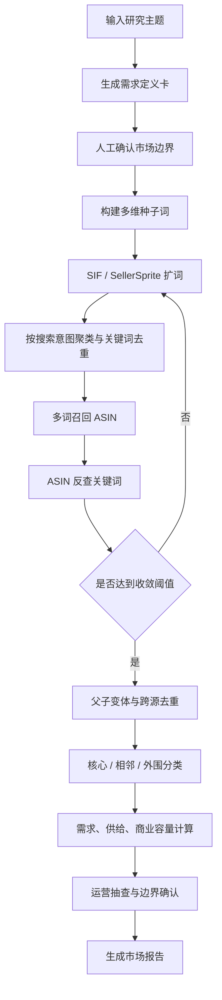

# 亚马逊细分市场边界与数据去重方法论

> 适用对象：Hsia 商品企划、产品研发、亚马逊运营与 Insight Agent 项目团队  
> 文档性质：方法论与 Agent 改造建议，不是 `minimizer bra` 的实际市场结论  
> 版本：v0.1，2026-07-10

## 1. 一句话结论

当前问题不在于卖家精灵和 SIF 的数据量不够，而在于研究流程仍然把“一个关键词”近似当成“一个市场”。真正可信的细分市场研究，必须先用用户需求定义市场边界，再建立关键词需求宇宙和 ASIN 供给宇宙，完成跨关键词、跨变体、跨数据源去重，并用覆盖率和新增样本收敛度证明研究已经足够完整。

## 2. 运营质疑的本质

运营提出的疑问可以整理成五个相互关联的问题。

### 2.1 数据是否去重

卖家精灵和 SIF 可能返回相同的关键词、ASIN、父子变体或同款不同链接。如果 Agent 只是把结果拼接起来，会出现：

- 同一个 ASIN 被多个关键词重复召回；
- 同一商品的不同颜色、尺码或子 ASIN 被重复计入商品数和销量；
- 同一个关键词的单复数、词序变化和近义表达被重复计入搜索需求；
- 两个工具返回的同一指标被当成两份独立证据；
- 不同时间窗口、站点或口径的数据被错误相加。

因此，“调用了两个专业数据源”不等于“完成了数据治理”。报告必须展示原始数量、去重后数量、去重规则和无法判断的部分。

### 2.2 一个关键词能否代表整个市场

不能。一个关键词只是用户需求的一种表达，也是平台流量的一个入口。

用户可能用以下方式表达同一个需求：

- 商品类别词：`minimizer bra`；
- 结果词：`bra that makes breasts look smaller`；
- 人群词：`bra for large bust`、`bra for heavy breasts`；
- 痛点词：`bra for breast projection`、`bra to prevent shirt gaping`；
- 结构或功能词：`full coverage side support bra`、`unlined supportive bra`；
- 场景词：`bra under button down shirt`、`office bra for large bust`。

反过来，搜索 `minimizer bra` 的人也不一定都在寻找同一种商品结构。因此，单关键词结果既可能漏掉真实需求，也可能混入不属于目标市场的商品。

### 2.3 `minimizer bra` 是不是一个真实细分市场

它可以是 Amazon 节点、商品标签或消费者熟悉的品类词，但不能自动等同于完整的用户需求市场。

更准确的研究对象应定义为：

> 美国丰满胸型用户为了降低视觉突出度、改善胸部轮廓、提升服装适配性，同时保持支撑和舒适，而购买的文胸解决方案集合。

这个需求市场可能包含明确标注 `minimizer` 的商品，也可能包含没有使用该词、但实际解决相同问题的 full coverage、side support、unlined、smoothing 或特定结构商品。

因此需要区分：

| 层级 | 定义 | 用途 |
| --- | --- | --- |
| Amazon 类目 | 平台节点或卖家填写的商品分类 | 观察平台货架结构 |
| 关键词市场 | 搜索某个词后形成的流量与商品集合 | 观察一个流量入口 |
| 功能市场 | 以明确功能承诺划定的商品集合 | 研究功能竞争 |
| 用户需求市场 | 以用户问题、目标结果和使用场景划定的解决方案集合 | 指导产品研发与机会判断 |

Hsia 的研发决策应以“用户需求市场”为主，以 Amazon 类目和关键词市场作为可量化的观察窗口，而不能反过来让平台标签决定市场定义。

### 2.4 怎样证明已经接近“全部品类信息”

公开工具很难证明抓到了绝对意义上的全部商品。正确目标不是声称“全量”，而是证明研究已经达到可审计的高覆盖和稳定收敛。

至少应回答：

- 覆盖了多少个不同搜索意图；
- 这些意图覆盖了多少已识别搜索需求；
- 每轮扩词还能发现多少新的高相关 ASIN；
- 核心 ASIN 是否在多个关键词和数据源中反复出现；
- Top ASIN、品牌和价格带是否已经趋于稳定；
- 哪些相邻市场被纳入，哪些被明确排除。

### 2.5 搜索量应该怎样参与判断

搜索量是需求信号，不是独立买家人数，也不能直接等同于市场销量。

合理用途包括：

- 判断用户真实使用的语言；
- 比较不同需求表达的强弱；
- 识别增长、衰退和季节性；
- 判断显性品类词与隐性需求词之间的需求分布；
- 为关键词簇和市场边界赋予权重。

不合理做法包括：

- 把所有近义词搜索量直接相加；
- 把搜索量当成独立消费者人数；
- 用一个关键词搜索量代表整个功能市场；
- 把 ABA 排名、搜索量、点击份额和销量混为同一指标。

## 3. 新的研究对象：三个宇宙

后续 Agent 不应直接从“输入关键词”跳到“生成市场报告”，而应先建立三个相互关联的数据集合。


### 3.1 关键词需求宇宙

包含用户为解决同一问题而使用的全部主要搜索表达，并按照搜索意图聚类，而不是只保留包含 `minimizer` 的词。

建议至少建立以下词簇：

| 词簇 | 研究问题 | `minimizer` 示例 |
| --- | --- | --- |
| 显性品类词 | 用户是否直接使用该品类名称 | minimizer bra、minimizing bra |
| 目标结果词 | 用户最终想获得什么效果 | make breasts look smaller、reduce bust projection |
| 人群与身体特征词 | 谁在寻找解决方案 | bra for large bust、bra for heavy breasts |
| 痛点词 | 用户正在避免什么 | shirt gaping、spillage、bulky bust shape |
| 结构与功能词 | 用户认为哪种结构能解决问题 | full coverage、side support、unlined support |
| 场景词 | 在什么穿着场景下产生需求 | office shirt、button-down shirt、under fitted tops |
| 品牌/竞品词 | 用户是否直接寻找某个品牌或型号 | 品牌名 + minimizer、竞品型号词 |

品牌词应单独标记，不能与非品牌通用需求混合计算。

### 3.2 ASIN 供给宇宙

通过多个关键词簇、Top ASIN、竞品反查和 Amazon 节点共同发现商品，再进行统一去重和相关性分类。

每个商品至少要记录：

- `asin`；
- `parent_asin`，若可得；
- `product_family_id`；
- 品牌、标题、价格、评分、评论数；
- 首次发现它的关键词；
- 命中的全部关键词和词簇；
- 所属 Amazon 节点；
- 功能声明和结构标签；
- 搜索流量或排名信号；
- 纳入层级、纳入理由和排除理由；
- 数据来源与采集时间。

### 3.3 评论与使用证据宇宙

标题和类目描述的是卖家如何定义商品，评论和社区讨论则用于判断消费者实际如何使用商品。

评论证据主要回答：

- 用户是否真的购买它来降低视觉胸量或改善轮廓；
- 用户使用了哪些与卖家不同的表达；
- 哪些结构真正产生了效果；
- 哪些副作用阻碍购买，例如压胸、变宽、钢圈戳、肩带短、罩杯溢出；
- 哪些没有写 `minimizer` 的商品实际上承担了同类任务。

评论不能用来直接估算市场容量，但可以校验市场边界和产品相关性。

## 4. 市场边界的定义方法

### 4.1 先写“需求定义”，再输入工具

每次研究开始前，Agent 应生成一张市场定义卡：

| 字段 | 需要回答的问题 |
| --- | --- |
| target_user | 谁存在这个需求 |
| job_to_be_done | 用户想完成什么任务 |
| desired_outcome | 用户期待的结果是什么 |
| pain_points | 当前方案哪里失败 |
| use_scenarios | 哪些场景触发购买 |
| solution_types | 哪些产品结构可能解决问题 |
| exclusions | 哪些相似产品不属于本次范围 |
| marketplace | 站点和国家 |
| time_range | 数据观察周期 |

### 4.2 使用三层边界

不要用一个二元标签把商品简单分成“属于/不属于”，建议分为：

| 市场层 | 纳入标准 | 报告用途 |
| --- | --- | --- |
| 核心市场 | 明确宣称目标功能，并获得关键词流量或用户使用证据支持 | 核心容量与直接竞品 |
| 功能相邻市场 | 未明确使用品类词，但解决相同任务，且有搜索或评论证据 | 产品替代与增量机会 |
| 外围市场 | 只有结构相似，缺少目标结果证据 | 只做观察，不计入核心容量 |

### 4.3 建立明确排除规则

以 `minimizer bra` 为例，以下商品不能因为标题里出现个别相似词就自动进入核心市场：

- 只强调 full coverage，但没有降低突出度或轮廓改善证据；
- 只强调大胸支撑，但消费者目标不是视觉显小；
- 运动压缩文胸，除非本次研究明确包含运动场景；
- 胸部塑形衣、束胸或术后产品，除非研究范围明确包含；
- 关键词广告召回但商品本身低相关的噪声 ASIN；
- 同款商品的颜色、尺码和套装变体。

## 5. 关键词宇宙的构建流程

### 5.1 第一轮：种子词

种子词不应只有用户输入的一个词，应同时来自：

1. 用户输入的品类词；
2. 产品团队提供的功能、结构和痛点词；
3. 已知头部竞品标题与卖点；
4. 真实评论和 Reddit 中的消费者语言；
5. Amazon 搜索建议或现有运营搜索词；
6. SIF 和卖家精灵返回的相关词、词根和 ABA 词。

### 5.2 第二轮：数据源扩展

| 数据源 | 主要作用 | 不应承担的任务 |
| --- | --- | --- |
| SIF keyword demand/history | 搜索需求、趋势、生命周期和季节性 | 单独定义完整市场规模 |
| SIF root trend | 扩展词根和长尾需求边界 | 直接判断商品是否属于市场 |
| SIF keyword competition | 观察关键词竞争、Top ASIN 和流量结构 | 把流量份额等同于销量份额 |
| SIF ASIN keyword signals | 从已知 ASIN 反向发现真实流量词 | 只分析一个 ASIN 后代表整个市场 |
| SellerSprite ABA/关键词工具 | 发现热门、增长和潜力关键词 | 把近义词搜索量直接相加 |
| SellerSprite market/product tools | 获取节点、商品、品牌、价格和供给结构 | 把 Amazon 节点当成用户需求全集 |
| 评论与 Reddit | 发现用户语言、使用场景和真实结果 | 直接估算销量或搜索规模 |

### 5.3 第三轮：从 ASIN 反向扩词

先用种子词找到第一批高相关 ASIN，再调用 ASIN 关键词信号，获取这些商品实际获得流量的词。这样可以发现标题中没有出现、但消费者真实使用的搜索表达。

建议至少选择：

- 每个核心词簇的 Top ASIN；
- 核心品牌的代表 ASIN；
- 高增长新品；
- 与核心市场边界存在争议的相邻商品。

### 5.4 第四轮：收敛判断

扩词和抓取不应无限进行。连续两轮满足以下条件时，可以认为当前范围基本收敛：

- 新增高相关关键词的需求占比低于既定阈值；
- 新增核心或功能相邻 ASIN 比例低于 5%；
- 主要品牌、Top ASIN 和价格带结构不再明显变化；
- 新词主要落入已有意图簇，而不是形成新的重要需求簇；
- 运营人工抽查没有发现明显遗漏的核心表达。

`5%` 是第一版可执行阈值，不是行业真理。后续应根据实际类目规模调整，并在每份报告中展示本次使用的阈值。

## 6. 去重方法

### 6.1 关键词去重

关键词至少经过三层处理：

1. **字面规范化**：统一大小写、单复数、标点、空格和常见拼写变化；
2. **语义聚类**：把表达同一购买意图的词放入同一词簇；
3. **流量口径去重**：同一词簇内不直接累加所有搜索量，保留词级明细并输出区间。

建议字段：

| 字段 | 说明 |
| --- | --- |
| raw_keyword | 数据源原始关键词 |
| normalized_keyword | 规范化关键词 |
| intent_cluster | 搜索意图簇 |
| brand_flag | 是否品牌词 |
| search_volume | 原始搜索量或代理指标 |
| metric_type | search volume、ABA rank、click share 等 |
| source | SIF、SellerSprite、Amazon 等 |
| period | 指标所属时间窗口 |
| include_status | core、adjacent、excluded |
| exclusion_reason | 排除原因 |

### 6.2 ASIN 去重

仅按 ASIN 去重还不够，因为不同子 ASIN 可能属于同一个商品家族。

去重优先级建议：

1. 有 `parent_asin` 时，以父 ASIN 形成 `product_family_id`；
2. 没有父 ASIN 时，使用品牌 + 型号/款号 + 标题核心词生成候选家族；
3. 再用主图、变体信息、关键卖点和规格进行校验；
4. 无法确认时保留为独立商品，但标记 `dedupe_confidence=low`；
5. 商品数和销量汇总均同时展示“ASIN 数”和“商品家族数”。

一条商品记录可以保留多个 `discovered_by_keyword`，但市场统计只计算一次。

### 6.3 跨数据源去重

同一 ASIN 在 SIF 和卖家精灵中出现时，应合并为一条主记录，同时保留字段级来源：

```text
ASIN 主键
  ├─ price: SellerSprite，采集日期 2026-07-10
  ├─ keyword_traffic: SIF，统计周期 2026-W27
  ├─ estimated_sales: SellerSprite，口径 monthly estimate
  └─ review_themes: Amazon reviews，样本 200 条
```

发生冲突时不应静默覆盖。报告应展示：

- 两个值及各自时间、站点和定义；
- 系统采用哪个值；
- 采用理由；
- 差异是否影响结论。

### 6.4 时间口径去重

周度、月度和实时快照不能直接相加。所有量化字段必须绑定：

- `marketplace`；
- `country`；
- `period_start`；
- `period_end`；
- `metric_definition`；
- `source`；
- `collected_at`。

## 7. 市场容量应该怎样计算

建议把“市场容量”拆成三个层次，而不是给出一个看似精确的单值。

### 7.1 需求容量

回答有多少搜索需求，以及需求是否增长。

输出内容：

- 各意图簇的代表关键词和搜索信号；
- 核心词、相邻词和品牌词的需求占比；
- 搜索趋势、同比、季节性和当前阶段；
- 保守下界、观察上界和重复风险说明。

同一意图簇可以采用：

- 最大代表词作为保守下界；
- 经去重审核后的词级合计作为观察上界；
- 明确标注该区间不是独立消费者人数。

### 7.2 供给容量

回答有多少独立商品家族、品牌和有效竞争者。

输出内容：

- 原始召回 ASIN 数；
- 去重后 ASIN 数；
- 去重后商品家族数；
- 核心、功能相邻和外围商品数；
- 品牌集中度、价格带、评分与评论量结构；
- 新品比例和上架时间分布。

### 7.3 商业容量

回答该需求对应的估算销量或销售额，但必须满足：

- 只使用有明确来源和时间窗口的估算字段；
- 同一父体下的子变体不得重复累计；
- 不把搜索量、点击份额或评论量换算成销量；
- 同时给出来源覆盖率和未覆盖商品；
- 使用“估算”“观察样本”“代理指标”，不得写成 Amazon 官方全市场真值。

## 8. 覆盖率与可信度指标

每份市场报告都应固定输出以下审计指标：

| 指标 | 计算或说明 |
| --- | --- |
| seed_keyword_count | 初始种子词数量 |
| expanded_keyword_count | 扩展后原始关键词数量 |
| unique_keyword_count | 字面去重后的关键词数量 |
| intent_cluster_count | 搜索意图簇数量 |
| demand_coverage | 已纳入词簇需求 / 全部候选词需求，需注明口径 |
| raw_asin_count | 所有查询累计召回的 ASIN 次数 |
| unique_asin_count | ASIN 去重后的数量 |
| product_family_count | 父子变体合并后的商品家族数量 |
| duplicate_rate | 1 - unique_asin_count / raw_asin_count |
| core_product_count | 核心市场商品家族数量 |
| adjacent_product_count | 功能相邻市场商品家族数量 |
| asin_discovery_gain | 最新一轮新增高相关 ASIN / 上一轮高相关 ASIN |
| source_overlap | SIF 与 SellerSprite 共同识别的核心 ASIN 比例 |
| unresolved_dedupe_count | 无法确定是否同款的记录数 |
| coverage_confidence | high、medium、low，并给出原因 |

这些指标比“本次抓了 100 个商品”更重要。抓取量只能说明工作量，不能说明市场覆盖率。

## 9. 建议的 Agent 工作流



### 9.1 建议拆成两个阶段

**阶段 A：市场边界审计**

先输出 Markdown 边界报告和可审核数据表，回答：研究的是哪个用户任务、覆盖了哪些词、纳入哪些商品、怎样去重、还缺什么。

**阶段 B：市场洞察报告**

只有阶段 A 通过人工确认后，才生成容量、趋势、竞争、痛点和研发机会报告。

这样可以避免 Agent 在市场边界还没有验证时，直接生成一份视觉完整但口径错误的 HTML 报告。

## 10. `minimizer bra` 示例

### 10.1 不再把输入词直接当作市场名

错误研究问题：

> `minimizer bra` 市场有多大？

建议改成：

> 美国 Amazon 丰满胸型用户为降低视觉突出度、改善胸部轮廓与服装适配而购买的文胸解决方案，其需求规模、供给结构和产品机会是什么？其中明确标注 minimizer 的核心市场占多少，未标注但满足相同任务的功能相邻市场占多少？

### 10.2 第一版边界假设

**核心市场：**

- 标题、bullet points 或 A+ 明确使用 minimize/minimizer 等功能承诺；
- 并且获得相关关键词流量、类目归属或评论使用证据支持。

**功能相邻市场：**

- 没有使用 minimizer 标签；
- 但通过 full coverage、side support、cup construction、unlined control 或 smoothing 等方案解决同一用户任务；
- 且有关键词或评论证据证明用户将其作为替代方案。

**外围市场：**

- 只满足大胸支撑、舒适或塑形中的一部分；
- 没有降低突出度或改善服装适配的证据。

### 10.3 报告应给出的答案

- 显性 `minimizer` 搜索需求有多强；
- 隐性需求词的搜索量是否高于显性品类词；
- 用户实际在用哪些词寻找解决方案；
- 核心和相邻商品家族分别有多少；
- 哪些头部 ASIN 同时占据多个意图簇；
- 哪些结构特征真正与目标结果和好评关联；
- 哪些用户痛点说明当前解决方案仍不充分；
- Hsia 应进入哪个需求簇，而不只是复制一个叫 `minimizer` 的产品。

## 11. 报告中的固定审计表

后续市场报告至少应增加以下四张表。

### 11.1 市场定义表

展示用户、任务、结果、场景、纳入范围和排除范围。

### 11.2 关键词覆盖表

展示每个关键词的词簇、搜索信号、来源、时间、是否纳入和排除理由。

### 11.3 ASIN 去重表

展示：

- 原始召回次数；
- 唯一 ASIN；
- 商品家族；
- 父子变体关系；
- 被哪些关键词召回；
- 核心/相邻/外围分类；
- 相关性与去重置信度。

### 11.4 数据来源与冲突表

展示同一指标在 SIF 和 SellerSprite 中的值、时间窗口、口径差异、最终采用值和选择理由。

## 12. 报告中禁止出现的表达

在没有完成边界和覆盖审计前，不应写：

- “我们抓取了该品类的全部商品”；
- “`minimizer bra` 的市场规模就是某个关键词的搜索量”；
- “100 个 ASIN 代表整个市场”；
- “将所有相关关键词搜索量相加就是总需求”；
- “所有子 ASIN 销量相加就是品牌真实销量”；
- “SIF 与卖家精灵结果一致，所以数据一定准确”；
- “点击份额、ABA 排名或评论量等于销量份额”。

建议使用：

- “在本次定义的需求边界和数据窗口内”；
- “已观察到的核心市场样本”；
- “去重后的商品家族”；
- “需求信号区间”；
- “第三方估算或代理指标”；
- “当前覆盖率与剩余数据缺口”。

## 13. 第一版验收标准

一份可进入运营和研发评审的市场报告，至少应满足：

- [ ] 先定义用户任务，而不是直接把单一关键词当成市场；
- [ ] 至少覆盖显性品类、目标结果、人群、痛点、结构和场景词；
- [ ] 关键词有规范化、意图聚类、品牌词标记和时间口径；
- [ ] 商品展示原始召回数、唯一 ASIN 数和商品家族数；
- [ ] 同一 ASIN 被多个词召回时只统计一次；
- [ ] 父子变体不会重复累计商品数和销量；
- [ ] SIF 与 SellerSprite 的字段保留各自来源和统计周期；
- [ ] 核心市场与功能相邻市场分开计算；
- [ ] 连续两轮扩展的新增高相关 ASIN 低于设定阈值；
- [ ] 报告展示覆盖率、去重率、低置信记录和数据缺口；
- [ ] 搜索量、ABA、点击份额、销量估算和评论量没有混用；
- [ ] 运营完成关键词与候选 ASIN 抽查后才生成最终洞察。

## 14. 对现有 Insight Agent 的改造优先级

### P0：先解决可信度

1. 新增“市场定义卡”和人工确认节点；
2. 保存每个关键词的来源、词簇和搜索指标；
3. 保存每个 ASIN 的全部召回关键词；
4. 实现 ASIN、父子变体和跨源去重；
5. 在报告中固定展示去重前后数量和覆盖率；
6. 在市场边界未通过审核时禁止生成最终市场结论。

### P1：扩大市场发现能力

1. 使用 SIF 词根与 ASIN 关键词信号迭代扩词；
2. 使用 SellerSprite ABA、节点和商品工具交叉验证；
3. 从评论和 Reddit 提取用户真实语言；
4. 建立核心、功能相邻和外围三层商品分类；
5. 增加扩词和 ASIN 发现的收敛判断。

### P2：提高自动化程度

1. 建立可复用的关键词意图词典；
2. 建立商品家族指纹和低置信人工队列；
3. 保存每周边界版本，观察新增词和新增 ASIN；
4. 用历史人工审核结果校准相关性评分和阈值。

## 15. 最终判断

运营的质疑是成立的。当前 Agent 即使能够成功调用 SIF 和卖家精灵，并生成一份内容完整、视觉良好的报告，也只能证明“数据采集与报告生成链路已经跑通”，还不能证明：

- 研究对象是真实、完整的细分需求市场；
- 关键词和商品没有重复统计；
- 搜索量、销量和竞争指标的口径一致；
- 报告中的市场容量具有可复核性。

下一阶段的重点不应是继续增加报告模块，而应先建立市场边界、去重、覆盖率和人工审核四项基础能力。完成这四项后，SIF、卖家精灵、Amazon 评论和 Reddit 的数据才会从“素材集合”升级为可以支持产品研发决策的证据系统。
