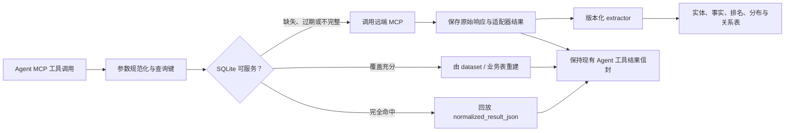

# MCP 本地 SQLite 数据镜像设计

状态：Proposal v0.1  
盘点日期：2026-07-23  
适用数据源：SellerSprite、Sif、FastMoss

## 1. 目标

本设计不是简单地把 MCP 返回 JSON 放进 SQLite，而是建立一个可逐步演进的本地数据镜像层：

1. 相同参数再次查询时，能够返回与当前 MCP Agent 适配器几乎一致的结果。
2. 对已采集的商品、关键词、类目、店铺、达人和内容数据，可以跨工具组合查询。
3. 保存历史快照，用于趋势、排名变化、结构变化和数据审计。
4. 支持关注对象定时更新，减少按报告重复调用远端 MCP。
5. 遇到本地数据缺失、过期、覆盖不完整或 Schema 不兼容时，安全回源 MCP。
6. 保留来源、市场、统计周期、查询过滤器、排序、分页和采集时间，不混淆不同口径。

本设计必须继续遵守现有报告链路：

```text
data tools
  -> build_<workflow>_report_data
  -> render_html_report
  -> synthesize_artifact
```

SQLite 只位于数据工具内部或下方。报告渲染器不能直接消费原始 MCP 响应、数据库全表或未经过 builder 限界的数据。

## 2. 当前接口盘点结论

实时 `tools/list` / Schema 目录共发现 126 个工具：

| Provider | 工具数 | Schema 来源 | 机器可读 outputSchema |
| --- | ---: | --- | --- |
| FastMoss | 55 | MCP `tools/list` | 无 |
| SellerSprite | 44 | MCP `tools/list` | 无 |
| Sif | 27 | `tool-schema.json` | 无 |
| 合计 | 126 |  |  |

SellerSprite 实时目录包含 `asin_competitor`，比当前 `docs/mcp-tools-sellersprite-sif.md` 中的 43 个工具多 1 个。

三家目前都只提供：

- 工具名；
- 工具描述；
- `inputSchema`；
- 实际调用后的 JSON/文本响应。

三家都没有提供机器可读的 `outputSchema`。因此：

1. 不能把第三方工具描述当成永远稳定的数据库 Schema。
2. 必须保存完整原始响应和适配器归一化后的完整结果。
3. 业务列由版本化 extractor 从响应中投影，不能成为唯一数据副本。
4. 工具描述、inputSchema 和真实响应字段都要做版本与漂移检测。

### 2.1 返回数据的通用 JSON 类型

现有 MCP 返回最终都会进入 Agent 工具结果信封：

```json
{
  "name": "provider_tool_name",
  "label": "Provider: tool_name",
  "status": "ok",
  "summary": "Provider returned structured evidence.",
  "duration_ms": 1234,
  "input": {},
  "data": {},
  "cache": {}
}
```

`data` 内部包含以下通用形态：

| 形态 | 例子 | 存储策略 |
| --- | --- | --- |
| 标量快照 | 总销量、GMV、评分、价格、搜索量 | 原始 JSON + 指标事实表 |
| 实体详情 | 商品、ASIN、店铺、达人、视频、直播、Agency | 原始 JSON + `entity` 与扩展属性 |
| 分页列表 | 搜索、榜单、关联商品、评论、视频列表 | 原始 JSON + dataset/row |
| 排名 | 商品榜、类目榜、达人榜、店铺榜 | ranking snapshot/item |
| 时间序列 | 日销量、周流量、价格、BSR、广告曝光 | metric observation / 热点投影表 |
| 分布桶 | 价格带、评分、粉丝层级、年龄、渠道 | distribution snapshot/bucket |
| 实体关系 | 商品-达人、商品-视频、店铺-商品、ASIN-关键词 | relation observation |
| 评论/VOC | 评论正文、星级、图片、SKU、时间 | review observation |
| 文本段 | 视频字幕、知识文档片段 | text segment |
| 派生判断 | Sif 异常诊断、画像、系统生成解释 | analysis snapshot |
| 系统/额度 | Credits、目录、连通状态、URL 模板 | system snapshot；不进入业务事实 |

## 3. 核心设计原则

### 3.1 双轨存储

每次成功调用至少保存两份逻辑表示：

1. `raw_response_json`：远端 MCP 原始响应，用于排障和未来重新解析。
2. `normalized_result_json`：当前 Insight Agent 适配器已经归一化的结果，用于原样回放。

规范化实体表和事实表是第三份可查询投影，但不是兼容层的唯一真相。

### 3.2 两种本地命中

| 命中模式 | 条件 | 保真程度 |
| --- | --- | --- |
| `exact_replay` | Provider、工具名、规范化参数和工具合同版本完全一致 | 最高，直接回放 `normalized_result_json` |
| `semantic_rebuild` | 没有完全相同参数，但已有覆盖该过滤器、周期、排序和分页的数据集 | 需逐工具验证后启用 |

第一阶段只启用 `exact_replay`。第二阶段再逐工具开放 `semantic_rebuild`。

### 3.3 不把空结果当成零市场

空结果可以写入调用日志，但默认：

- `is_empty = 1`；
- `is_servable = 0`；
- 只设置短暂重试等待期；
- 不进入市场为零、销量为零或无人销售等业务事实。

这与 FastMoss 当前数据透明规则和现有 `mcp_result_cache.py` 行为一致。

### 3.4 不静默合并不同 Provider 的同名指标

SellerSprite 与 Sif 都可能返回销量、搜索量、流量、排名等字段。唯一键必须包含：

- Provider；
- 工具；
- 指标定义版本；
- 市场；
- 统计周期；
- 实体；
- 采集时间或数据截至时间。

跨 Provider 对比由分析层完成，不能在入库时用一个值覆盖另一个值。

### 3.5 业务 ID 一律存 TEXT

以下 ID 即使看起来是数字，也统一保存为 `TEXT`：

- TikTok product_id；
- seller_id；
- creator uid；
- video_id；
- room_id；
- agency_id；
- Amazon ASIN / parent ASIN；
- campaign/ad group ID；
- 类目节点 ID。

这样可以避免 64 位整数溢出、前导零丢失、加密 ID 和未来格式变化。

## 4. 读写架构



本地返回建议在现有 `cache` 元数据中增加：

```json
{
  "hit": true,
  "backend": "sqlite",
  "mode": "exact_replay",
  "provider": "fastmoss",
  "tool": "mcp__fastmoss__product_sales_trend",
  "fetched_at": "2026-07-23T03:12:00Z",
  "data_as_of": "2026-07-22",
  "expires_at": "2026-07-24T03:12:00Z",
  "stale": false,
  "coverage": {
    "complete": true
  },
  "response_id": 12345
}
```

除 `duration_ms` 和 `cache` 外，`exact_replay` 不应修改原适配器结果的业务字段。

## 5. SQLite 物理约定

### 5.1 数据库位置

建议默认：

```text
.cache/insight-agent.sqlite3
```

环境变量：

```text
INSIGHT_DATA_DB_PATH
```

数据库文件、WAL 文件和备份不得提交 Git。

### 5.2 PRAGMA

连接初始化：

```sql
PRAGMA journal_mode = WAL;
PRAGMA foreign_keys = ON;
PRAGMA synchronous = NORMAL;
PRAGMA busy_timeout = 5000;
PRAGMA temp_store = MEMORY;
```

禁止在持有写事务时调用远端 MCP。正确顺序是：

1. 短事务领取同步任务；
2. 提交事务；
3. 调用远端；
4. 用新的短事务批量写入。

### 5.3 SQLite 类型

| 业务类型 | SQLite 类型 | 说明 |
| --- | --- | --- |
| 主键 | `INTEGER PRIMARY KEY` | 使用 SQLite rowid |
| 外部 ID | `TEXT` | 不使用 INTEGER |
| UTC 时间 | `TEXT` | ISO-8601，统一 `Z` |
| 市场自然日期 | `TEXT` | `YYYY-MM-DD` |
| 周/月周期键 | `TEXT` | 保留 Provider 原始口径 |
| 布尔值 | `INTEGER` | 0/1 |
| 计数 | `INTEGER` | 保留原始 JSON 防止异常类型 |
| 分数、比例、GMV | `REAL` | 精确回放仍以 JSON 为准 |
| 金额币种 | `REAL` + `currency_code` | 不跨币种静默相加 |
| JSON | `TEXT CHECK(json_valid(...))` | 使用 JSON1 |
| Hash | `TEXT` | SHA-256 十六进制 |

## 6. 表设计

### 6.1 协议与兼容层：第一阶段必须实现

#### `db_meta`

| 字段 | 类型 | 说明 |
| --- | --- | --- |
| `key` | TEXT PK | 配置键 |
| `value` | TEXT | 配置值 |
| `updated_at` | TEXT | 更新时间 |

保存数据库 Schema 版本、首次创建时间和迁移状态。

#### `mcp_provider`

| 字段 | 类型 | 说明 |
| --- | --- | --- |
| `id` | INTEGER PK | 内部 ID |
| `name` | TEXT UNIQUE | fastmoss / sellersprite / sif |
| `display_name` | TEXT | 展示名 |
| `endpoint` | TEXT | 可选，不含密钥 |
| `enabled` | INTEGER | 是否启用 |
| `created_at` | TEXT | 创建时间 |
| `updated_at` | TEXT | 更新时间 |

不保存 API Key、Token 或 Secret。

#### `mcp_tool`

| 字段 | 类型 | 说明 |
| --- | --- | --- |
| `id` | INTEGER PK | 工具 ID |
| `provider_id` | INTEGER FK | Provider |
| `mcp_name` | TEXT | 远端工具名 |
| `agent_name` | TEXT | Insight Agent 工具名 |
| `description` | TEXT | 当前工具说明 |
| `active` | INTEGER | 当前目录是否存在 |
| `current_schema_hash` | TEXT | 当前合同 Hash |
| `first_seen_at` | TEXT | 首次发现 |
| `last_seen_at` | TEXT | 最近发现 |

唯一约束：`(provider_id, mcp_name)`。

#### `mcp_tool_schema`

| 字段 | 类型 | 说明 |
| --- | --- | --- |
| `id` | INTEGER PK | 版本 ID |
| `tool_id` | INTEGER FK | 工具 |
| `schema_hash` | TEXT | 描述 + inputSchema 的 Hash |
| `input_schema_json` | TEXT JSON | 完整 inputSchema |
| `description` | TEXT | 当时的工具说明 |
| `output_contract_json` | TEXT JSON | 本项目根据文档和真实样本维护的返回合同 |
| `contract_confidence` | TEXT | observed / documented / inferred |
| `captured_at` | TEXT | 抓取时间 |

唯一约束：`(tool_id, schema_hash)`。

#### `mcp_query`

表示稳定的“工具 + 规范化参数”查询身份。

| 字段 | 类型 | 说明 |
| --- | --- | --- |
| `id` | INTEGER PK | 查询 ID |
| `tool_id` | INTEGER FK | 工具 |
| `params_hash` | TEXT | 与现有 cache identity 对齐 |
| `canonical_params_json` | TEXT JSON | 排序后的规范化参数 |
| `semantic_scope_hash` | TEXT | 去除分页等非业务字段后的数据集范围 Hash |
| `market_code` | TEXT | US/UK/DE 等 |
| `period_start` | TEXT | 查询周期起点 |
| `period_end` | TEXT | 查询周期终点 |
| `period_key` | TEXT | Provider 原始周/月键 |
| `granularity` | TEXT | day/week/month/cumulative |
| `page` | INTEGER | 页码 |
| `page_size` | INTEGER | 每页数量 |
| `sort_json` | TEXT JSON | 排序规则 |
| `created_at` | TEXT | 首次创建 |
| `last_requested_at` | TEXT | 最近请求 |

唯一约束：`(tool_id, params_hash)`。

#### `mcp_call_attempt`

每次真实远端调用一行，失败也保留。

| 字段 | 类型 | 说明 |
| --- | --- | --- |
| `id` | INTEGER PK | 调用 ID |
| `query_id` | INTEGER FK | 查询身份 |
| `trigger` | TEXT | interactive / scheduled / refresh / backfill |
| `started_at` | TEXT | 开始时间 |
| `finished_at` | TEXT | 完成时间 |
| `duration_ms` | INTEGER | 耗时 |
| `status` | TEXT | ok/partial_ok/empty/error/needs_user_action |
| `remote_error_code` | TEXT | 远端错误码 |
| `error_summary` | TEXT | 脱敏错误摘要 |
| `credit_cost` | REAL | 可获取时记录 |
| `sync_run_id` | INTEGER FK | 所属同步任务 |

#### `mcp_response_snapshot`

兼容层最重要的表。

| 字段 | 类型 | 说明 |
| --- | --- | --- |
| `id` | INTEGER PK | 响应 ID |
| `query_id` | INTEGER FK | 查询身份 |
| `call_attempt_id` | INTEGER FK | 原始远端调用 |
| `tool_schema_hash` | TEXT | 调用时工具合同 |
| `extractor_version` | TEXT | 业务投影器版本 |
| `status` | TEXT | Agent 状态 |
| `raw_response_json` | TEXT JSON | MCP 原始响应 |
| `normalized_result_json` | TEXT JSON | 适配器完整结果 |
| `response_hash` | TEXT | 结果内容 Hash |
| `fetched_at` | TEXT | 实际采集时间 |
| `data_as_of` | TEXT | 数据截至时间 |
| `period_start` | TEXT | 数据周期起点 |
| `period_end` | TEXT | 数据周期终点 |
| `expires_at` | TEXT | 默认新鲜度截止 |
| `is_current` | INTEGER | 当前查询键的最新成功版本 |
| `is_servable` | INTEGER | 是否允许本地返回 |
| `is_empty` | INTEGER | 是否空结果 |
| `is_partial` | INTEGER | 是否部分成功 |
| `coverage_json` | TEXT JSON | 分页、样本、时间和实体覆盖 |
| `quality_json` | TEXT JSON | 类型异常、缺字段、时间口径等 |
| `created_at` | TEXT | 写入时间 |

索引：

```text
(query_id, is_current, fetched_at DESC)
(expires_at, is_servable)
(response_hash)
```

每个 `query_id` 最多一个 `is_current = 1` 的成功响应。

#### `mcp_dataset`

表示可以支持分页或语义重建的完整/部分数据集。

| 字段 | 类型 | 说明 |
| --- | --- | --- |
| `id` | INTEGER PK | 数据集 ID |
| `tool_id` | INTEGER FK | 原始工具 |
| `semantic_scope_hash` | TEXT | 业务范围 Hash |
| `market_code` | TEXT | 市场 |
| `filter_json` | TEXT JSON | 不含分页的过滤条件 |
| `sort_json` | TEXT JSON | 排序 |
| `period_start` | TEXT | 周期起点 |
| `period_end` | TEXT | 周期终点 |
| `granularity` | TEXT | 粒度 |
| `total_count` | INTEGER | Provider 声明总数 |
| `collected_count` | INTEGER | 已去重行数 |
| `first_page` | INTEGER | 已采首页 |
| `last_page` | INTEGER | 已采末页 |
| `is_complete` | INTEGER | 是否完整 |
| `coverage_json` | TEXT JSON | 缺页、截断和硬上限 |
| `fetched_from` | TEXT | 首次采集时间 |
| `fetched_to` | TEXT | 最后采集时间 |
| `expires_at` | TEXT | 数据集新鲜度 |

#### `mcp_dataset_row`

| 字段 | 类型 | 说明 |
| --- | --- | --- |
| `id` | INTEGER PK | 行 ID |
| `dataset_id` | INTEGER FK | 数据集 |
| `row_key` | TEXT | Provider 内稳定行键 |
| `row_index` | INTEGER | Provider 排序位置 |
| `entity_id` | INTEGER FK NULL | 可识别实体 |
| `source_response_id` | INTEGER FK | 来源响应 |
| `row_json` | TEXT JSON | 原始业务行 |
| `row_hash` | TEXT | 行 Hash |

唯一约束：`(dataset_id, row_key)`。

#### `data_quality_issue`

| 字段 | 类型 | 说明 |
| --- | --- | --- |
| `id` | INTEGER PK | 问题 ID |
| `response_id` | INTEGER FK | 响应 |
| `severity` | TEXT | info/warn/block |
| `code` | TEXT | 稳定问题码 |
| `json_path` | TEXT | 对应字段路径 |
| `expected_type` | TEXT | 期望类型 |
| `actual_type` | TEXT | 实际类型 |
| `details_json` | TEXT JSON | 详情 |
| `created_at` | TEXT | 时间 |

### 6.2 调度层：定时同步必须实现

#### `sync_target`

| 字段 | 类型 | 说明 |
| --- | --- | --- |
| `id` | INTEGER PK | 关注任务 |
| `tool_id` | INTEGER FK | 工具 |
| `name` | TEXT | 人类可读名称 |
| `params_template_json` | TEXT JSON | 固定/模板参数 |
| `priority` | INTEGER | 优先级 |
| `refresh_policy` | TEXT | fixed/adaptive/immutable_period |
| `refresh_interval_seconds` | INTEGER | 基础频率 |
| `stale_while_revalidate_seconds` | INTEGER | 可返回旧数据的窗口 |
| `max_pages` | INTEGER | 最大翻页数 |
| `daily_credit_budget` | REAL | 单任务预算 |
| `enabled` | INTEGER | 是否启用 |
| `last_success_at` | TEXT | 最近成功 |
| `next_due_at` | TEXT | 下次执行 |
| `lease_owner` | TEXT | 调度租约 |
| `lease_expires_at` | TEXT | 租约截止 |

#### `sync_run`

| 字段 | 类型 | 说明 |
| --- | --- | --- |
| `id` | INTEGER PK | 运行 ID |
| `target_id` | INTEGER FK | 关注任务 |
| `started_at` | TEXT | 开始 |
| `finished_at` | TEXT | 完成 |
| `status` | TEXT | running/succeeded/partial/failed/skipped |
| `pages_requested` | INTEGER | 请求页数 |
| `remote_calls` | INTEGER | 实际远端调用数 |
| `rows_upserted` | INTEGER | 入库行数 |
| `credits_used` | REAL | 可获取时记录 |
| `error_summary` | TEXT | 脱敏错误 |

### 6.3 统一实体层

#### `market`

保存平台、站点、时区和默认币种。时间口径转换必须引用此表。

#### `category`

| 关键字段 | 说明 |
| --- | --- |
| `provider_id` | FastMoss 或 SellerSprite |
| `platform` | tiktok_shop / amazon |
| `native_id` | Provider 类目 ID |
| `market_id` | 所属市场 |
| `level` | 类目层级 |
| `name` / `name_localized` | 名称 |
| `path_text` / `path_json` | 完整路径 |
| `parent_category_id` | 父节点 |
| `first_seen_at` / `last_seen_at` | 生命周期 |
| `attrs_json` | 未投影属性 |

唯一约束必须包含 Provider 和市场，不能假定不同 Provider 的类目 ID 等价。

#### `entity`

统一保存可被工具引用的业务对象：

```text
amazon_product
tiktok_product
product_variant
shop
amazon_seller
brand
creator
video
live
agency
ad_creative
campaign
ad_group
trademark
```

关键字段：

| 字段 | 说明 |
| --- | --- |
| `entity_type` | 对象类型 |
| `platform` | amazon / tiktok_shop / provider_system |
| `market_id` | 市场 |
| `native_id` | ASIN、product_id、uid 等 |
| `canonical_name` | 当前名称 |
| `canonical_url` | Provider 详情页优先 |
| `image_url` | 当前主图 |
| `current_attrs_json` | 当前未投影属性 |
| `first_seen_at` / `last_seen_at` | 发现时间 |

唯一约束：`(platform, market_id, entity_type, native_id)`。

#### `entity_alias`

保存同一实体在不同 Provider 或接口中的标识：

- parent ASIN / child ASIN；
- campaign 加密 ID / fake ID；
- TikTok detail URL / FastMoss URL；
- SellerSprite ASIN URL；
- 名称、handle、历史名称。

不做不确定的自动跨平台商品合并。人工确认或高置信映射需要保存 `mapping_method` 和 `confidence`。

#### `product_variant`

保存 SKU、子 ASIN、颜色、尺码、材料等稳定维度。销量与库存仍进入事实表。

#### `keyword`

| 关键字段 | 说明 |
| --- | --- |
| `market_id` | 市场 |
| `keyword_text` | 原词 |
| `normalized_text` | 仅用于查重，不改写原词 |
| `language_code` | 语言 |
| `root_text` | 有明确工具证据时保存 |

唯一约束：`(market_id, normalized_text, language_code)`。

#### `campaign` 与 `ad_group`

Sif 广告层级需要稳定实体表，保存：

- ASIN/Listing 归属；
- campaign/ad group 多种 ID；
- 广告类型；
- 创建日期；
- 名称；
- 历史结构范围。

### 6.4 通用事实层

#### `metric_observation`

长表，用于保存尚未进入热点宽表的标量和时间点：

| 字段 | 说明 |
| --- | --- |
| `entity_id` | 指标对象 |
| `relation_id` | 可选，关系指标 |
| `provider_id` / `tool_id` | 来源 |
| `source_response_id` | 可追溯响应 |
| `metric_code` | 稳定内部指标名 |
| `provider_field_path` | 原始 JSON 路径 |
| `metric_definition_version` | 口径版本 |
| `value_num` / `value_text` / `value_json` | 三选一 |
| `unit` / `currency_code` | 单位 |
| `period_start` / `period_end` | 统计周期 |
| `granularity` | day/week/month/window/cumulative |
| `observed_at` / `data_as_of` | 采集时间与数据时间 |

同一业务指标只有在定义明确时才共用 `metric_code`。

#### `ranking_snapshot` 与 `ranking_item`

支持 FastMoss 类目、商品、店铺、达人、Agency 榜单，以及 SellerSprite 头部商品/品牌/卖家列表。

`ranking_snapshot` 保存市场、类目、周期、过滤条件、排序字段、总数和覆盖率。  
`ranking_item` 保存对象、名次、排名指标和完整 `row_json`。

#### `distribution_snapshot` 与 `distribution_bucket`

统一保存：

- 价格区间；
- 评分值、评分数、上架时间；
- EBC/A+/视频组合；
- 卖家国家、发货类型；
- 品牌、卖家、商品集中度；
- FastMoss 粉丝层级、年龄、性别、地区；
- 类目、价格带、销售渠道、内容渠道；
- 广告渠道、推荐来源。

必须保存 Provider 原始区间边界语义，例如 FastMoss 价格区间的左开右闭规则。

#### `relation_observation`

统一保存带时间口径的多对多关系：

```text
product -> shop
product -> creator
product -> video
creator -> product
creator -> video
shop -> product
shop -> creator
shop -> video
shop -> live
live -> product
agency -> creator
agency -> product
agency -> shop
asin -> keyword
asin -> competitor_asin
campaign -> ad_group
ad_group -> keyword
```

字段包括 `from_entity_id`、`to_entity_id`、`relation_type`、周期、来源响应和 `metrics_json`。

#### `review_observation`

保存 FastMoss 商品评论和 SellerSprite Amazon 评论：

- Provider review ID；
- 商品/ASIN；
- 星级；
- 标题；
- 正文；
- 作者公开标识；
- 评论时间；
- SKU/颜色/尺码；
- verified/Vine 等返回标志；
- 图片 URL JSON；
- helpful 指标；
- 首次和最近观察时间；
- 来源响应；
- 原始 `review_json`。

唯一键优先使用 Provider review ID；没有稳定 ID 时使用“商品 + 时间 + 作者 + 正文 Hash”。

#### `text_segment`

保存 FastMoss 视频字幕和知识文档片段：

- 所属 video/document；
- segment index；
- start/end time；
- text；
- language；
- source response。

#### `analysis_snapshot`

保存 Sif `analyze_traffic_anomaly`、广告画像和其他派生结构：

- 分析类型；
- 目标实体；
- 输入依赖 response IDs；
- Mermaid；
- reasoning；
- conclusion；
-完整 JSON；
-有效期。

派生分析过期时间必须取其依赖数据的最短有效期，不能比底层数据更新。

#### `event_observation`

保存有明确业务时间的离散事件，例如：

- Sif `campaign_created`；
- 广告组创建；
- 商品首次上架或下架状态变化；
- 直播开始/结束；
- Provider 返回的其他结构变化事件。

字段包括 `entity_id`、`related_entity_id`、`event_type`、`event_at`、`provider_id`、
`tool_id`、`source_response_id` 和 `attrs_json`。由相邻时间点差分推断的事件必须标注
`is_inferred = 1`，不能伪装成 Provider 明确返回的事件。

#### `system_snapshot`

保存不属于市场事实、但运行时需要保留的 Provider 状态：

- FastMoss credit usage；
- FastMoss URL 模板；
- Sif catalog；
- ping/连通状态；
- 其他账号级或系统级返回。

字段包括 `provider_id`、`tool_id`、`snapshot_type`、`data_json`、`fetched_at`、
`expires_at` 和 `source_response_id`。账号凭证、Token 和 Secret 不得写入。

## 7. 第一批热点投影表

通用事实表可以覆盖全部 126 个工具，但高频工作流应增加宽表，避免 Agent 每次从 JSON 或长表拼装。

### 7.1 TikTok Shop / FastMoss

| 表 | 主要字段 |
| --- | --- |
| `fm_product_daily` | product、date、GMV、units、累计 GMV/units、新增 creator/video/live、AOV |
| `fm_shop_daily` | shop、date、GMV、units、活跃商品、新增 creator/video/live |
| `fm_creator_daily` | creator、date、followers change、plays、engagement、GMV、units、video/live/showcase 拆分 |
| `fm_video_daily` | video、date、plays、likes、comments、shares、commerce metrics |
| `fm_ad_daily` | video/ad、date、spend、ROAS、plays、engagement、GMV、units |
| `fm_product_sku_snapshot` | product、SKU、价格、库存、销售份额、库存份额、观察时间 |

### 7.2 Amazon / SellerSprite + Sif

| 表 | 主要字段 |
| --- | --- |
| `amazon_listing_snapshot` | ASIN、parent ASIN、价格、评分、评论数、BSR、卖家、配送、badge、观察时间 |
| `amazon_listing_period_metric` | ASIN、Provider、周期、销量代理、销售额、价格、BSR、评分数 |
| `amazon_keyword_period` | keyword、Provider、周期、搜索量、购买量、购买率、ABA rank、PPC、供需比、集中度 |
| `amazon_asin_keyword_period` | ASIN、keyword、周期、自然/广告排名、流量份额、渠道份额、健康度 |
| `amazon_traffic_channel_period` | ASIN/Listing/variant、周期、natural/SP/recSP/SB/SBV 分数或词数 |
| `amazon_ad_entity_period` | campaign/ad group、周期、曝光得分、贡献、份额、变化率 |
| `amazon_keepa_point` | ASIN、time、metric、value |
| `amazon_prediction_point` | ASIN/BSR、date、预测销量、销售额、价格、BSR、预测口径 |

热点表唯一键始终包含 Provider。即使 SellerSprite 与 Sif 都返回 ASIN 销量，也不覆盖彼此。

## 8. 全部工具到存储模型的映射

下面的工具清单覆盖实时目录的全部 126 个工具。所有工具首先进入协议与兼容层，表中只列额外的业务投影。

### 8.1 FastMoss：55 个

| 家族 | 工具 | 主要返回形态 | 主要投影 |
| --- | --- | --- | --- |
| 广告 | `ad_data_overview`, `ad_search` | 广告实体、视频/达人/店铺/商品关系、花费、ROAS、播放与电商表现 | entity、relation、`fm_ad_daily`、dataset |
| Agency | `agency_creator_analysis`, `agency_product_analysis`, `agency_product_list`, `agency_profile_overview`, `agency_rank_top`, `agency_search`, `agency_shop_analysis` | Agency 详情、榜单、达人/商品/店铺列表、类目与价格分布、周期表现 | entity、ranking、distribution、relation、metric |
| 达人 | `creator_cargo_summary`, `creator_data_trends`, `creator_fans_distribution`, `creator_product_list`, `creator_profile_overview`, `creator_rank_top_ecommerce`, `creator_rank_top_growth`, `creator_rank_top_potential`, `creator_search`, `creator_video_analysis` | 达人详情、28 日 GMV、榜单、日趋势、粉丝画像、带货商品与视频 | entity、`fm_creator_daily`、ranking、distribution、relation |
| 直播 | `live_detail_analysis`, `live_products_list`, `live_search` | 直播详情、主持达人、直播表现、类目与商品列表、销售时间线 | entity、relation、metric、distribution、dataset |
| 市场类目 | `market_category_analysis`, `market_category_author_sales_matrix`, `market_category_ranking`, `product_category_info`, `search_category_by_words` | 类目树、规模、增长、集中度、价格分布、趋势、类目榜和达人层级矩阵 | category、metric、ranking、distribution |
| 商品 | `product_creator_analysis`, `product_detail_info`, `product_investment`, `product_overview`, `product_rank_new_listed`, `product_rank_top_selling`, `product_review_list`, `product_sales_trend`, `product_search`, `product_sku`, `product_video_list` | 商品详情、店铺、榜单、日销量/GMV、渠道分布、广告、SKU、评论、达人和视频 | entity、`fm_product_daily`、`fm_product_sku_snapshot`、ranking、distribution、relation、review |
| 店铺 | `shop_base_info`, `shop_creator_analysis`, `shop_data_trends`, `shop_investment_analysis`, `shop_live_analysis`, `shop_product_analysis`, `shop_rank_top_selling`, `shop_sale_analysis`, `shop_search`, `shop_video_analysis` | 店铺详情、榜单、日趋势、商品/达人/视频/直播列表、渠道和价格/类目分布、广告 | entity、`fm_shop_daily`、ranking、distribution、relation |
| 视频 | `video_data_trends`, `video_detail_analysis`, `video_script_info`, `video_search` | 视频详情、互动日趋势、关联商品、字幕文本 | entity、`fm_video_daily`、relation、text segment |
| 系统/文档 | `credit_usage_summary`, `fastmoss_detail_url_examples`, `search_fastmoss_documents` | 额度、URL 模板、知识文档 | system snapshot、text segment；不进入销售事实 |

### 8.2 SellerSprite：44 个

| 家族 | 工具 | 主要返回形态 | 主要投影 |
| --- | --- | --- | --- |
| 市场与分布 | `market_ebc_distribution`, `market_price_distribution`, `market_ratings_count_distribution`, `market_listing_date_distribution`, `market_product_demand_trend`, `market_product_concentration`, `market_brand_concentration`, `market_listing_trend_distribution`, `market_research_statistics`, `market_rating_distribution`, `market_seller_country_distribution`, `market_seller_type_concentration`, `market_research`, `market_seller_concentration` | 市场规模、成熟度、需求、头部商品/品牌/卖家、各种区间与结构分布 | category、ranking、distribution、market/listing metric |
| 关键词与 ABA | `google_trend`, `aba_research_weekly`, `keyword_order`, `keyword_research_trends`, `aba_research_trend`, `keyword_miner`, `aba_research_monthly`, `keyword_research` | 关键词搜索/购买/PPC/竞争指标、ABA 周/月榜、趋势、ASIN 反查词 | keyword、`amazon_keyword_period`、`amazon_asin_keyword_period`、ranking |
| 商品与 ASIN | `review`, `asin_prediction`, `asin_coupon_trend`, `asin_competitor`, `keepa_info`, `product_research`, `competitor_lookup`, `asin_detail`, `asin_sales_trend`, `bsr_prediction`, `asin_detail_with_coupon_trend` | ASIN 详情、父子体、商品筛选、竞品、评论、价格/BSR/评分历史、销售预测、优惠 | entity、variant、review、`amazon_listing_snapshot`、period metric、Keepa/prediction point、relation |
| 流量 | `traffic_keyword_stat`, `traffic_listing_stat`, `traffic_extend`, `traffic_source`, `traffic_keyword`, `traffic_listing` | ASIN 关键词、自然/推荐/广告词统计、关联商品、免费/付费结构 | `amazon_asin_keyword_period`、`amazon_traffic_channel_period`、relation、dataset |
| 商标 | `trademark_list`, `trademark_stats`, `trademark_detail`, `trademark_country_list` | 商标列表、详情、统计和国家目录 | entity、metric、dataset |
| 类目节点 | `product_node` | Amazon 类目路径、节点 ID、商品数量 | category |

### 8.3 Sif：27 个

| 家族 | 工具 | 主要返回形态 | 主要投影 |
| --- | --- | --- | --- |
| 广告结构 | `ads_get_asin_ad_structure`, `ads_get_campaign_structure` | ASIN 广告类型、campaign 数、campaign-ad group 历史结构 | campaign、ad_group、relation、metric |
| 广告趋势 | `ads_get_asin_ad_traffic_trend`, `ads_get_campaign_traffic_trend`, `ads_get_ad_group_traffic_trend` | SP/SB/SBV、campaign、ad group 周/月曝光趋势和变化率 | `amazon_ad_entity_period`、metric |
| 广告贡献与关键词 | `ads_get_asin_campaign_contribution_overview`, `ads_get_campaign_contribution_breakdown`, `ads_get_ad_group_keyword_breakdown` | campaign/ad group/keyword 贡献、份额、排名历史、展示 ASIN | relation、`amazon_ad_entity_period`、`amazon_asin_keyword_period` |
| 广告画像与事件 | `ads_get_asin_ad_window_feature_profile`, `ads_get_asin_ad_feature_profile`, `ads_get_asin_ad_historical_feature_profile`, `ads_get_asin_campaign_changes` | 集中度、渠道组合、投放节奏、增长轨迹、campaign_created 事件 | analysis snapshot、distribution、metric/event |
| 市场关键词 | `market_get_keyword_history`, `market_get_keyword_root_trend`, `market_get_keyword_competition`, `market_get_asin_keyword_signals`, `market_get_keyword_demand` | ABA 历史、词根需求、生命周期、Top ASIN 竞争、ASIN 关键词健康与渠道依赖 | keyword、`amazon_keyword_period`、`amazon_asin_keyword_period`、ranking、analysis |
| 运营销量 | `ops_get_asin_sales_trend`, `ops_get_asin_sales_list` | ASIN/颜色/尺码/材料销量代理、当前价格和月度趋势 | entity、variant、`amazon_listing_period_metric` |
| 运营流量 | `ops_get_listing_traffic_structure`, `ops_get_listing_keyword_distribution`, `ops_get_listing_traffic_overview`, `ops_get_asin_traffic_trend_detail`, `ops_get_asin_traffic_trend` | Listing/variant 的自然与广告渠道分数、关键词数量、关键词明细和时间序列 | `amazon_traffic_channel_period`、`amazon_asin_keyword_period`、distribution |
| 诊断 | `analyze_traffic_anomaly` | Mermaid、推理过程、结论和行动建议 | analysis snapshot，依赖响应指纹 |
| 系统 | `ping`, `sif_catalog` | 连通状态、工具目录 | system snapshot；不进入业务事实 |

## 9. 新鲜度与定时更新策略

| 数据类别 | 建议默认 | 说明 |
| --- | --- | --- |
| 工具目录和 Schema | 每日 | Hash 未变化时不新增版本 |
| 类目树、URL 模板 | 30 天 | 工具 Schema 变化时提前刷新 |
| 已完成的周/月榜、ABA 周/月数据 | 长期有效 | 以 Provider 修订窗口为准，可在首次获取后 7 天复核一次 |
| 商品/店铺/达人静态详情 | 7 天 | 活跃对象可缩短 |
| 当前榜单 | 24 小时 | 热门类目可 6-12 小时 |
| 商品/店铺/达人/视频日趋势 | 24 小时 | 每天补昨天，避免反复拉完整窗口 |
| Sif 关键词与流量 | 周数据每周；近 7/30 天每日 | 保留 timePieceType/timePieceValue |
| SellerSprite 市场分布 | 每周 | 市场结构无需小时级刷新 |
| 评论 | 每 7 天增量 | 去重；重点 ASIN 可每日 |
| 活跃广告、直播 | 1-6 小时 | 仅限关注对象 |
| 派生诊断 | 依赖数据最短 TTL | 依赖数据变化即失效 |
| 空结果 | 15-60 分钟 | 不作为可服务业务事实 |
| 鉴权/额度错误 | 不缓存为业务结果 | 记录调用日志，修复后立即重试 |

建议使用自适应刷新：

- 最近 7 天被查询过：基础频率；
- 被多个报告复用或处于增长期：提高频率；
- 30 天未使用：降频；
- 90 天未使用且不在人工关注清单：停更；
- 达到当日调用预算：按优先级延后。

## 10. 语义重建的安全条件

只有同时满足以下条件，才允许从业务表或 `mcp_dataset_row` 重建 MCP 风格结果：

1. Provider 和工具相同。
2. 市场、币种、统计周期和时区口径相同。
3. 本地数据的过滤范围是请求范围的超集。
4. 排序字段及其定义相同。
5. 已采集页覆盖请求页。
6. `total_count`、截断上限和缺页状态已知。
7. 工具 Schema Hash 与 extractor 支持版本匹配。
8. 所需字段没有被投影过程丢失。
9. 数据仍在新鲜度窗口内，或用户明确允许 stale 数据。
10. 返回中标注 `mode = semantic_rebuild` 和 coverage。

不能确认时必须回源，不能为了“提高缓存命中率”返回看似完整但实际截断的数据。

## 11. Schema 漂移处理

每日获取工具目录后：

1. 对 `description + canonical(inputSchema)` 计算 `schema_hash`。
2. Hash 变化时写入 `mcp_tool_schema` 新版本。
3. 将该工具标记为 `contract_review_required`。
4. 精确回放旧响应仍可用，但禁止旧 extractor 对新响应做语义重建。
5. 保存新响应字段路径和 JSON 类型，与当前 output contract 比较。
6. 关键字段缺失、类型变化或数组结构变化时写入 `data_quality_issue`。

返回合同的置信度：

| 级别 | 定义 |
| --- | --- |
| `observed` | 已有真实响应样本验证字段与类型 |
| `documented` | 工具说明明确声明，但本地暂无真实响应 |
| `inferred` | 从相邻工具或业务语义推断，只能保存原始 JSON，不能用于强业务结论 |

## 12. 实施顺序

### Phase 1：SQLite 精确回放

实现：

- 协议与兼容层表；
- 工具目录版本；
- 从现有 `.cache/mcp-results` 迁移；
- `exact_replay`；
- `bypassCache` 强制回源；
- 调用日志、空结果和错误策略；
- WAL 与并发测试。

这一阶段就能替换当前文件缓存，并保留现有 MCP 体验。

### Phase 2：关注清单和定时同步

实现：

- `sync_target` / `sync_run`；
- 独立 CLI 同步进程；
- Windows Task Scheduler 定时启动；
- 预算、重试、退避、租约；
- 已完成周期冻结。

不要把定时调度循环放进 Web Server 进程。

### Phase 3：高频业务投影

优先顺序：

1. FastMoss 商品、店铺、达人、视频日趋势；
2. Amazon ASIN、关键词、ASIN-关键词和流量渠道；
3. 排名、分布、关系和评论；
4. Sif 广告 campaign/ad group 层级。

### Phase 4：逐工具语义重建

优先开放：

- 明确日期范围的趋势工具；
- 已完成周期榜单；
- 类目节点和详情工具；
- 已完整采集的分页列表。

搜索、Provider 内部相关性排序、预测和派生诊断应最后开放，必要时长期保持精确回放或远端调用。

## 13. 必须具备的测试

1. 126 个实时工具全部落入一个存储映射家族。
2. 完全相同参数的 SQLite 回放与首次 Agent 适配器结果业务字段一致。
3. dict 参数顺序不同不改变 `params_hash`。
4. SellerSprite 评论逻辑时间窗口仍能复用缓存。
5. `empty` 不作为可服务数据。
6. `partial_ok` 保留 coverage，并按 Evidence Contract 决定能否使用。
7. Schema Hash 变化会阻止不兼容的语义重建。
8. 排名和分页缺页时不会伪装成完整结果。
9. SellerSprite 与 Sif 同一 ASIN 指标不会互相覆盖。
10. SQLite 多线程并发不会产生重复当前响应或长时间写锁。
11. `bypassCache=true` 会真实调用远端并更新 current snapshot。
12. 数据库损坏或不可用时，可降级为远端 MCP，而不是让 Agent 无数据可用。

## 14. 暂不做的事情

- 不全量镜像三家所有市场和全部对象。
- 不根据标题自动合并 Amazon 商品与 TikTok 商品。
- 不下载和保存商品/评论/视频图片二进制，只保存授权范围内的 URL 和元数据。
- 不把 Sif 诊断文本当作原始市场事实。
- 不让 renderer 直接查询 SQLite。
- 不在没有完整数据集覆盖证明时模拟 Provider 搜索与排名算法。
- 不把本地数据库做成对外数据再分发服务。

## 15. 下一项设计工作

在开始编码前，需要基于本设计继续产出：

1. SQLite v1 DDL 与迁移编号；
2. `McpResultStore` Python 接口；
3. 现有 JSON 缓存迁移规范；
4. 126 个工具的 output contract registry；
5. 第一批 extractor 清单；
6. 各工具/数据家族的具体 TTL 配置；
7. 本机调度 CLI 和 Windows Task Scheduler 运行方式。
